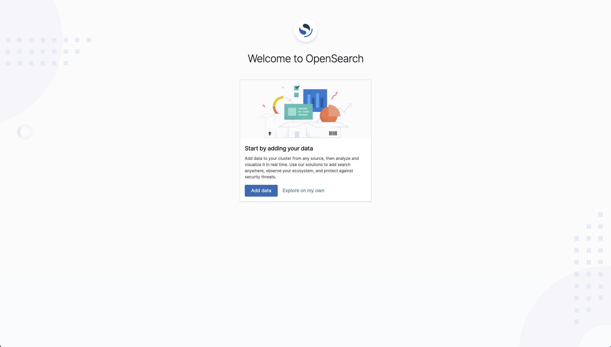
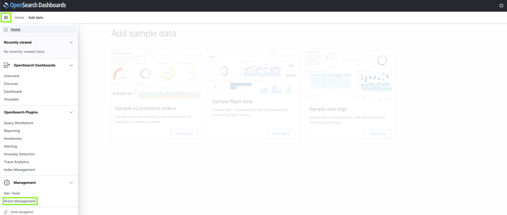
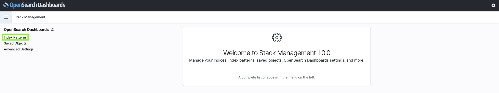
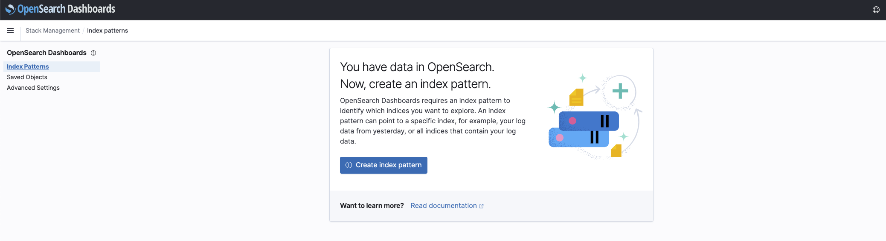
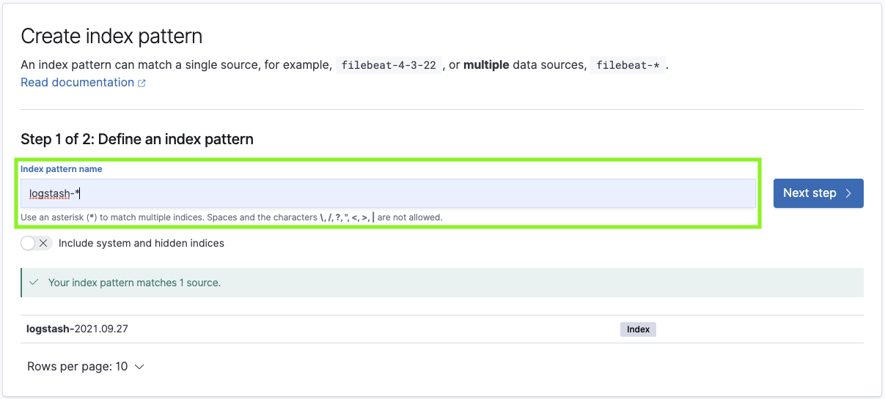
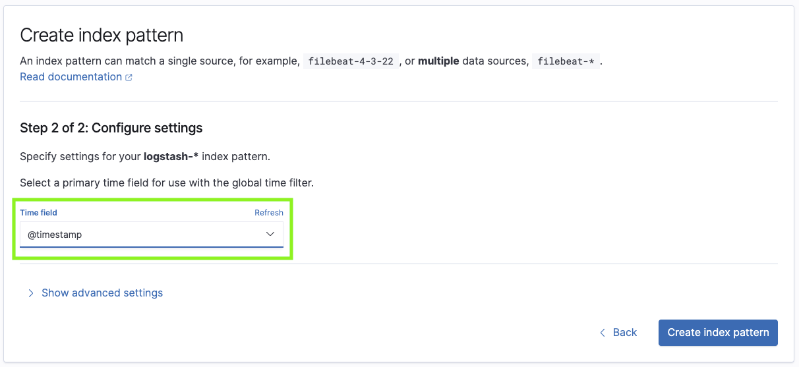
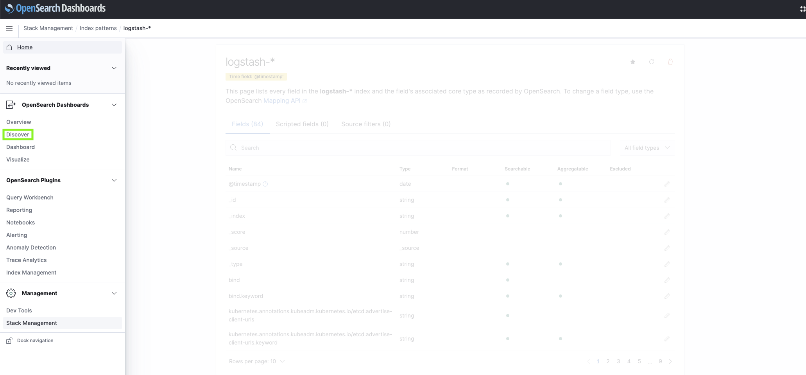

# a8s Demo Script

## Prerequisites

### git Submodule

This repo uses the [a8s-deployment][a8s-deployment] repo as a submodule.

To correctly initialize it, either clone this repo with the `--recurse-submodules` flag or invoke
`git submodule update --init` after cloning.

Otherwise, some of the commands shown in this file will fail (loudly and without side effects).

### Backups Store Configuration

Before installing the a8s framework we need to ensure that the relevant configuration files for
the a8s-backup-manager are there. More precisely, we need to create individual files in the
`a8s-deployment/deploy/a8s/backup-config` directory which are used to configure the external object
store with its corresponding authentication credentials as well as an encryption key for the backup.

```shell
# create file that stores the ID of the key
echo <bucket-access-key-id> > a8s-deployment/deploy/a8s/backup-config/access-key-id 

# create file that stores the secret value of the key
echo <bucket-secret-access-key> > a8s-deployment/deploy/a8s/backup-config/secret-access-key 

# create file that stores password for backup encryption
echo <encryption password> > a8s-deployment/deploy/a8s/backup-config/encryption-password 

# create file with other information about the bucket
cp a8s-deployment/deploy/a8s/backup-config/backup-store-config.yaml.template a8s-deployment/deploy/a8s/backup-config/backup-store-config.yaml 
```

The last file from the previous command contains the cloud provider, name and region of the bucket
where the backups will be stored. It looks like:

```yaml
config:
  cloud_configuration:
    provider: "AWS"
    container: a8s-shared-backups
    region: eu-central-1
```

You'll need to set the values of the three fields to match the bucket ("container" in the file)
where you want the backups to be stored.

### Operator SDK

If we want to install the a8s data services framework using the Operator Lifecycle Manager (OLM)
we also need to ensure that the `operator-sdk` binary is present on our machine. If this is not the
case follow the [official OLM installation instructions][OLM installation] to install the
operator-sdk binary.

## Installation

There are two methods to install the a8s data services framework. One is by applying static yaml
files and the other one is by using the Operator Lifecycle Manager (OLM). The main benefit of using
the OLM for installation is that it can lifecycle manage the Operators. This makes it the preferred
installation method but requires the installation of the OLM components. The static yaml manifests
approach is GitOps compatible and does not have any specific requirements.

The OLM installation can be customized (if needed) according to [the official OLM documentation](https://olm.operatorframework.io/docs/getting-started/)

### [Option 1] Install a8s Framework using Static YAML Files

When we want to install the a8s framework using static yaml files we need to install the
cert-manager first. The cert-manager is responsible for generating certificates for validating,
defaulting and CRD conversion webhooks.

The following command will install the cert-manager and wait for the cert-manager to be fully
initialized.

```shell
kubectl apply --kustomize a8s-deployment/deploy/cert-manager
```

```shell
watch kubectl get pods --namespace cert-manager
```

We should get something similar to the following output:

```shell
Every 2,0s: kubectl get pods --namespace cert-manager

NAME                                       READY   STATUS    RESTARTS   AGE
cert-manager-5bb9dd7d5d-xjzcz              1/1     Running   0          22s
cert-manager-cainjector-6586bddc69-68mz2   1/1     Running   0          22s
cert-manager-webhook-6fc8f4666b-jwp5t      1/1     Running   0          22s
```

Next we want to install the a8s data services framework by running the following command:

```shell
kubectl apply --kustomize a8s-deployment/deploy/a8s/manifests
```

This will create a new namespace `a8s-system` and deploy all the required resources.

Now we can run the following command to get all pods from the a8s-system namespace.

```shell
watch kubectl get pods --namespace a8s-system
```

After running the command above we should see something similar to the output below.

```shell
Every 2,0s: kubectl get pods --namespace a8s-system
NAME                                                  READY   STATUS    RESTARTS   AGE
a8s-backup-controller-manager-5f5587d564-w7k9k        2/2     Running   0          40s
postgresql-controller-manager-668686f64d-6pzqs        2/2     Running   0          40s
service-binding-controller-manager-644d94dfd4-vhxdd   2/2     Running   0          40s
```

Afterwards the a8s data services framework has been successfully installed, and we can proceed
with provisioning a PostgreSQL instance.

### [Option 2] Install a8s Framework using OLM

In order to install the a8s data services framework using the OLM we need to install the OLM
components in our cluster. We can do this by executing

```shell
operator-sdk olm install
```

We should see an output similar to:

```shell
NAME                                            NAMESPACE    KIND                        STATUS
catalogsources.operators.coreos.com                          CustomResourceDefinition    Installed
clusterserviceversions.operators.coreos.com                  CustomResourceDefinition    Installed
installplans.operators.coreos.com                            CustomResourceDefinition    Installed
olmconfigs.operators.coreos.com                              CustomResourceDefinition    Installed
operatorconditions.operators.coreos.com                      CustomResourceDefinition    Installed
operatorgroups.operators.coreos.com                          CustomResourceDefinition    Installed
operators.operators.coreos.com                               CustomResourceDefinition    Installed
subscriptions.operators.coreos.com                           CustomResourceDefinition    Installed
olm                                                          Namespace                   Installed
operators                                                    Namespace                   Installed
olm-operator-serviceaccount                     olm          ServiceAccount              Installed
system:controller:operator-lifecycle-manager                 ClusterRole                 Installed
olm-operator-binding-olm                                     ClusterRoleBinding          Installed
cluster                                                      OLMConfig                   Installed
olm-operator                                    olm          Deployment                  Installed
catalog-operator                                olm          Deployment                  Installed
aggregate-olm-edit                                           ClusterRole                 Installed
aggregate-olm-view                                           ClusterRole                 Installed
global-operators                                operators    OperatorGroup               Installed
olm-operators                                   olm          OperatorGroup               Installed
packageserver                                   olm          ClusterServiceVersion       Installed
operatorhubio-catalog                           olm          CatalogSource               Installed
```

Afterwards we can proceed with deploying the a8s data services framework using OLM which will
create:

- the namespace a8s-system.
- a CatalogSource referencing the a8s catalog which contains references to our operators
- an OperatorGroup a8s-operators linked to the a8s-system namespace, which can be used to adjust
  general permission for all operators in that group.
- a Subscription to the a8s postgresql-operator. A Subscription indicates our desire to have the
  operator installed to the cluster, the OLM will then fetch the bundle of the PostgreSQL operator
  and its dependencies, which includes the a8s-backup-manager and a8s-service-binding-controller.
  These bundles then contain the instructions for the OLM to create the same resources as explained
  in the manifest section.

Execute the following command to install the a8s data services framework using the OLM:

```shell
kubectl apply --kustomize a8s-deployment/deploy/a8s/olm
```

The command shown above should result in the following output:

```shell
namespace/a8s-system created
configmap/a8s-backup-store-config created
secret/a8s-backup-storage-credentials created
operatorgroup.operators.coreos.com/a8s-operators created
catalogsource.operators.coreos.com/a8s-catalog created
subscription.operators.coreos.com/a8s-backup-and-restore created
subscription.operators.coreos.com/a8s-postgresql created
subscription.operators.coreos.com/a8s-service-binding-controller created
```

Validate that the a8s data services framework is indeed up and running by executing:

```shell
watch kubectl get pods --namespace a8s-system --selector app.kubernetes.io/component=controller-manager
```

which should result in an output similar to:

```shell
Every 2,0s: kubectl get pods --namespace a8s-system --selector app.kubernetes.io/component=controller-manager

NAME                                                              READY   STATUS      RESTARTS   AGE
a8s-backup-controller-manager-5c57596f76-7gdcs                    2/2     Running     0          76s
postgresql-controller-manager-5dcd6cbbfd-tprxj                    2/2     Running     0          73s
service-binding-controller-manager-6948fbd679-mcdbx               2/2     Running     0          71s
```

## Instance Creation, Usage and Deletion

Now that the a8s data services framework is up and running we can proceed by creating a new
PostgreSQL instance and using it with a demo application.

### PostgreSQL Instance Creation

If we want to create a new PostgreSQL instance we can simply apply a manifest. We should first
execute the following command and show that manifest:

```shell
cat a8s-deployment/examples/postgresql-instance.yaml
```

Then, we can apply the manifest to create the instance:

```shell
kubectl apply --filename a8s-deployment/examples/postgresql-instance.yaml
```

In case we have a multi node Kubernetes cluster running which consists of 3 or more nodes and
specific node labels are set, we can showcase the topology awareness functionality of our PostgreSQL
Operator where each PostgreSQL instance Pod is placed on its own node. This is risky though
because there are a lot of potential pitfalls. If you really want to showcase that functionality
follow the [a8s-deployment documentation](https://github.com/anynines/a8s-deployment/blob/develop/docs/application-developers/advanced_configuration.md).

The command above will create a PostgreSQL instance which consists of 3 replicas. Now we have to
wait until the PostgreSQL cluster members are up and running. Run the following command to see the
number of ready replicas.

```shell
watch kubectl get postgresql sample-pg-cluster --output template='{{.status}}'
```

We should wait until the number of ready replicas matches the number of replicas specified in
the spec of the PostgreSQL Custom Resource we applied.

```shell
# Output of the watch command shown above
Every 2,0s: kubectl get postgresql sample-pg-cluster --output template={{.status}}

map[clusterStatus:Running readyReplicas:3]
```

When deploying a PostgreSQL instance for the first time this can take a while as all the container
images need to be pulled from an external registry first. Once the container images have been pulled
they are cached on the Kubernetes node and subsequent instance creations will be a lot faster.

### PostgreSQL Instance Usage

Next we want to deploy a PostgreSQL demo app (`a9s-postgresql-app`) that will
use the new PostgreSQL instance to store data.

Show its manifest via this command:

```shell
cat demo-app/demo-app-deployment.yaml
```

First, we need to create a service binding resource that will configure a user for the demo app in
the PostgreSQL database and store the credentials for that user in a Kubernetes API secret.

Show its manifest first:

```shell
cat a8s-deployment/examples/service-binding.yaml
```

Then, apply:

```shell
kubectl apply --filename a8s-deployment/examples/service-binding.yaml
```

We can check on the status of the service binding by using:

```shell
watch kubectl get servicebinding sb-sample --output template='{{.status.implemented}}'
```

and should get

```shell
Every 2,0s: kubectl get servicebinding sb-sample --output template={{.status.implemented}}

true
```

as a result.

The a8s-service-binding-controller creates a secret which contains the credentials for the
PostgreSQL user that has been created. This secret is named by the `metadata.name` field with
`-service-binding` as a suffix. The secret will then be mounted in the demo application in order to
actually use the service binding user. We can fetch the secret by executing:

```shell
kubectl get secret sb-sample-service-binding -o yaml
```

this command should result in an output similar to:

```shell
apiVersion: v1
data:
  database: <database>
  instance_service: <instance_name>
  password: <password>
  username: <username>
kind: Secret
metadata:
  creationTimestamp: "2022-10-20T07:58:11Z"
  labels:
    service-binding: "true"
  name: sb-sample-service-binding
  namespace: default
  ownerReferences:
  - apiVersion: servicebindings.anynines.com/v1alpha1
    blockOwnerDeletion: true
    controller: true
    kind: ServiceBinding
    name: sb-sample
    uid: f00643ed-d4aa-4abb-8155-506878df1630
  resourceVersion: "6850"
  uid: 1c1f5bd8-b8eb-4845-8f89-cf0e3d8120bb
type: Opaque
```

Now we can proceed with deploying the demo application:

```shell
kubectl apply --kustomize demo-app/
```

Executing:

```shell
watch kubectl get pods --selector app=demo-app
```

should result in something like:

```shell
NAME                        READY   STATUS              RESTARTS   AGE
demo-app-796d8f6f86-v5xsf   1/1     Running             0          43s
```

If we want to use a port-forward to access the demo applications dashboard, execute the following
command:

```shell
kubectl port-forward service/demo-app 3000:3000
```

and then

```shell
open http://localhost:3000
```

to open the dashboard.

Create a new blog post entry by clicking on the "Create Post" button in the top right corner.

Next we'll create a backup of the current state of the database with our single blog post.

Show the manifest first:

```shell
cat a8s-deployment/examples/backup.yaml
```

Then apply it:

```shell
kubectl apply --filename a8s-deployment/examples/backup.yaml
```

In order to wait for the backup to complete we can execute:

```shell
kubectl wait backup backup-sample --for=condition=complete
```

which should eventually result in

```shell
backup.backups.anynines.com/backup-sample condition met
```

To test the restore functionality, we'll first create another blog entry and then restore to the
latest backup (which doesn't have the newly added entry).

Show the manifest first:

```shell
cat a8s-deployment/examples/restore.yaml
```

Then apply it:

```shell
kubectl apply --filename a8s-deployment/examples/restore.yaml
```

Just as for the backup we also need to wait here for the restore to complete:

```shell
kubectl wait restore recovery-sample --for=condition=complete
```

which should eventually result in:

```shell
restore.backups.anynines.com/recovery-sample condition met
```

Due to some limitations of PostgreSQL in combination with the metrics exporter we use, the
PostgreSQL replication leader Pod needs to be restarted for the restore to take effect.
This causes the demo application to stop working until the Pod is up and running again. So please
wait for 15-20 seconds before reloading the dashboard (otherwise nothing bad happens, it is just
that the dashboard will be unaccessible). Afterwards we can reload the dashboard of the demo
application and we should see that the second blog post entry we previously created has been removed.

### PostgreSQL Instance Deletion

We can delete an existing PostgreSQL instance by executing:

```shell
kubectl delete --filename a8s-deployment/examples/postgresql-instance.yaml
```

Deletion is performed by scaling down the number of PostgreSQL replicas to 0. In order to show
this behavior perform:

```shell
watch kubectl get postgresql sample-pg-cluster --output template='{{.status.readyReplicas}}'
```

and you should see that the number of replicas decreases.

## [Optional] Show the Failover Capabilities of the PostgreSQL Operator

To demonstrate the automated failover capabilities of our PostgreSQL instances, we first need to
create a PostgreSQL instance by executing

```shell
kubectl apply --filename a8s-deployment/examples/postgresql-instance.yaml
```

and wait for it to become ready

```shell
watch kubectl get postgresql sample-pg-cluster --output template='{{.status}}'
```

As soon as all of our 3 replicas become ready we can proceed by
checking which of our pods is currently the replication leader:

```shell
watch kubectl get pods --selector a8s.a9s/replication-role=master
```

which should give an output similar to

```shell
Every 2,0s: kubectl get pods --selector a8s.a9s/replication-role=master

NAME                  READY   STATUS    RESTARTS   AGE
sample-pg-cluster-0   3/3     Running   0          19m
```

Now we can proceed with forcing a failover from the replication leader to a replication standby.
Unfortunately this does not work by simply deleting the Pod with the master label. Instead, we will
use Patroni to force a failover. Open a new terminal and move both windows side by side (or use
tmux) so that we can see the output of the watch command from above as well as the next command we
will execute.

```shell
kubectl exec --stdin --tty sample-pg-cluster-0 --container postgres -- /usr/local/bin/patronictl failover
```

which should result in:

```shell
Candidate ['sample-pg-cluster-1', 'sample-pg-cluster-2'] []:
```

Now we have to enter one of the standbys listed in the returned array (it doesn't matter which
one we choose).

```shell
# Enter one of the replicas listed in the returned prompt from patronictl
Candidate ['sample-pg-cluster-1', 'sample-pg-cluster-2'] []: sample-pg-cluster-2
```

which should give us an output similar to

```shell
Current cluster topology
+ Cluster: sample-pg-cluster (7155482187446120565) -----+----+-----------+
| Member              | Host        | Role    | State   | TL | Lag in MB |
+---------------------+-------------+---------+---------+----+-----------+
| sample-pg-cluster-0 | 10.244.3.19 | Leader  | running |  1 |           |
| sample-pg-cluster-1 | 10.244.2.17 | Replica | running |  1 |         0 |
| sample-pg-cluster-2 | 10.244.1.24 | Replica | running |  1 |         0 |
+---------------------+-------------+---------+---------+----+-----------+
Are you sure you want to failover cluster sample-pg-cluster, demoting current master sample-pg-cluster-0? [y/N]:
```

Now we need to enter `y` in order to approve the failover. We should get something similar to

```shell
2022-10-18 07:37:26.90871 Successfully failed over to "sample-pg-cluster-2"
+ Cluster: sample-pg-cluster (7155482187446120565) -----+----+-----------+
| Member              | Host        | Role    | State   | TL | Lag in MB |
+---------------------+-------------+---------+---------+----+-----------+
| sample-pg-cluster-0 | 10.244.3.19 | Replica | stopped |    |   unknown |
| sample-pg-cluster-1 | 10.244.2.17 | Replica | running |  1 |         0 |
| sample-pg-cluster-2 | 10.244.1.24 | Leader  | running |  1 |           |
+---------------------+-------------+---------+---------+----+-----------+
```

as a result, which indicates that the failover was successful. Furthermore, we should see in
our second terminal window that in the running watch command the Pod with the
`a8s.a9s/replication-role=master` has changed to the one we chose for our failover.

## [Optional] Show the Configuration Capabilities of the PostgreSQL Operator

Our PostgreSQL Operator allows users to specify PostgreSQL configuration parameters in the
manifest. This includes both bootstrapping a PostgreSQL instance with the desired configuration
parameters as well as updating an existing instance. When the PostgreSQL configuration field is
omitted a defaulting webhook will provide sane default values for the configuration parameters.

For the sake of simplicity we will create an instance with default configuration parameters, update
that instance and then show that the new configuration parameters have been applied.

First we want to create an instance by executing:

```shell
kubectl apply --filename a8s-deployment/examples/postgresql-instance.yaml
```

and then wait for the instance to be ready:

```shell
watch kubectl get postgresql sample-pg-cluster --output template='{{.status}}'
```

Once the number of ready replicas matches the number of desired replicas we can proceed be showing
the current value of the `max_connections` (which is 100 by default). We can do so by running

```shell
kubectl exec sample-pg-cluster-0 --container postgres -- "psql" "-U" "postgres" "-c" "SHOW max_connections;"
```

which will return

```shell
 max_connections 
-----------------
 100
(1 row)
```

Now we can proceed by updating the `max_connections` field within the manifest of the PostgreSQL
instance. Add the following lines to the spec field of the manifest:

```shell
postgresConfiguration:
  maxConnections: 120
```

afterwards the manifest should look like this:

```shell
apiVersion: postgresql.anynines.com/v1beta3
kind: Postgresql
metadata:
  name: sample-pg-cluster
spec:
  replicas: 3
  volumeSize: 1Gi
  version: 14
  postgresConfiguration:
    maxConnections: 120
  resources:
    requests:
      cpu: 100m
    limits:
      memory: 100Mi
```

and re-apply the manifest:

```shell
kubectl apply --filename a8s-deployment/examples/postgresql-instance.yaml
```

now we can again execute

```shell
kubectl exec sample-pg-cluster-0 --container postgres -- "psql" "-U" "postgres" "-c" "SHOW max_connections;"
```

but this time we should get

```shell
 max_connections 
-----------------
 120
(1 row)
```

as a result, which means that our desired value for the `max_connections` configuration property has
been successfully applied.

## [Optional] Show the PostgreSQL Extension Capabilities of the PostgreSQL Operator

One important feature of our PostgreSQL Operator is that it can install PostgreSQL extensions
on-demand. This includes both the installation of extensions "on creation" of a PostgreSQL
instance as well as adding extensions to an existing one. It is worth mentioning that the installation of
PostgreSQL extensions is done via init-containers which means that when updating the list of
extensions on an existing PostgreSQL instance a rolling update is triggered.

To showcase the extension management capabilities of the PostgreSQL Operator, we first
create an instance without any extensions, check the total number of available extensions,
update the instance manifest and then check again the total number of available extensions.

We will start by creating a new instance without any extensions installed:

```shell
kubectl apply --filename a8s-deployment/examples/postgresql-instance.yaml
```

and wait until all replicas are ready:

```shell
watch kubectl get postgresql sample-pg-cluster --output template='{{.status}}'
```

As soon as the PostgreSQL instance is ready (the number of ready replicas matches the number of
desired replicas) we can get the list (and number) of available PostgreSQL extensions by executing:

```shell
kubectl exec sample-pg-cluster-0 --container postgres -- psql -U postgres -d a9s_apps_default_db -c "select * from pg_available_extensions;"
```

which should result in:

```shell
... Simplified as the output would be too big ...

 pg_freespacemap                | 1.2             |                   | examine the free space map (FSM)
 pllua                          | 2.0             |                   | Lua as a procedural language
 file_fdw                       | 1.0             |                   | foreign-data wrapper for flat file access
 tablefunc                      | 1.0             |                   | functions that manipulate whole tables, including crosstab
 ltree_plpython3u               | 1.0             |                   | transform between ltree and plpython3u
 pgq_node                       | 3.4             |                   | Cascaded queue infrastructure
 hll                            | 2.16            |                   | type for storing hyperloglog data
 pgaudit                        | 1.6.2           |                   | provides auditing functionality
 plpgsql_check                  | 2.1             |                   | extended check for plpgsql functions
 hstore_pllua                   | 1.0             |                   | Hstore transform for Lua
 refint                         | 1.0             |                   | functions for implementing referential integrity (obsolete)
 insert_username                | 1.0             |                   | functions for tracking who changed a table
 postgis-3                      | 3.2.1           |                   | PostGIS geometry and geography spatial types and functions
 pg_surgery                     | 1.0             |                   | extension to perform surgery on a damaged relation
 postgis_topology               | 3.2.1           |                   | PostGIS topology spatial types and functions
 hstore_plluau                  | 1.0             |                   | Hstore transform for untrusted Lua
(97 rows)
```

As we can see we currently have 97 available PostgreSQL extensions. Now we will update the manifest
of our instance to install two extensions. Add the following lines to the spec field in the
manifest:

```shell
extensions:
  - "MobilityDB"
  - "pg-qualstats"
```

which should result in:

```shell
apiVersion: postgresql.anynines.com/v1beta3
kind: Postgresql
metadata:
  name: sample-pg-cluster
spec:
  replicas: 3
  volumeSize: 1Gi
  version: 14
  extensions:
    - "MobilityDB"
    - "pg-qualstats"
  resources:
    requests:
      cpu: 100m
    limits:
      memory: 100Mi
```

Now we need to apply this change

```shell
kubectl apply --filename a8s-deployment/examples/postgresql-instance.yaml
```

to update the existing PostgreSQL instance. By re-running

```shell
kubectl exec sample-pg-cluster-0 --container postgres -- psql -U postgres -d a9s_apps_default_db -c "select * from pg_available_extensions;"
```

we should get

```shell
 pg_freespacemap                | 1.2             |                   | examine the free space map (FSM)
 pllua                          | 2.0             |                   | Lua as a procedural language
 file_fdw                       | 1.0             |                   | foreign-data wrapper for flat file access
 tablefunc                      | 1.0             |                   | functions that manipulate whole tables, including crosstab
 ltree_plpython3u               | 1.0             |                   | transform between ltree and plpython3u
 pgq_node                       | 3.4             |                   | Cascaded queue infrastructure
 hll                            | 2.16            |                   | type for storing hyperloglog data
 pgaudit                        | 1.6.2           |                   | provides auditing functionality
 plpgsql_check                  | 2.1             |                   | extended check for plpgsql functions
 hstore_pllua                   | 1.0             |                   | Hstore transform for Lua
 refint                         | 1.0             |                   | functions for implementing referential integrity (obsolete)
 insert_username                | 1.0             |                   | functions for tracking who changed a table
 postgis-3                      | 3.2.1           |                   | PostGIS geometry and geography spatial types and functions
 pg_surgery                     | 1.0             |                   | extension to perform surgery on a damaged relation
 postgis_topology               | 3.2.1           |                   | PostGIS topology spatial types and functions
 hstore_plluau                  | 1.0             |                   | Hstore transform for untrusted Lua
 mobilitydb                     | 1.0.0           |                   | MobilityDB Extension
 pg_qualstats                   | 2.0.4           |                   | An extension collecting statistics about quals
(99 rows)
```

as a result which indicates that the two desired extensions are indeed installed. If we want to
actually use those extensions we need to load them by running

```shell
kubectl exec sample-pg-cluster-0 --container postgres -- psql -U postgres -d a9s_apps_default_db -c 'CREATE EXTENSION "pg_qualstats";'
```

which should result in

```shell
WARNING:  Without shared_preload_libraries, only current backend stats will be available.
CREATE EXTENSION
```

which means that the extensions has been successfully loaded.

## Logging

With a8s, we provide optional YAML manifests that deploy on the Kubernets cluster a logging stack to
collect, store and analyze the logs of your data service instances and other pods running in the
cluster.

The logging stack is based on three technologies:

- [OpenSearch][opensearch]: a search and analytics engine to store and analyze logs.
- [Fluentd][fluentd]: a centralized logs collector.
- [FluentBit][fluentbit]: a lightweight logs processor and forwarder.

More precisely, the logging stack comprises:

- A FluentBit [DaemonSet][daemonset] that collects all the logs from the pods on every Kubernetes
  node and forwards them to a Fluentd aggregator.
- A [StatefulSet][statefulset] that runs a Fluentd singleton that aggregates all the logs in the
  cluster.
- A [StatefulSet][statefulset] that runs an OpenSearch singleton that stores all the logs (after
  having received them from the Fluentd aggregator) and exposes endpoints to query and analyze the
  logs.
- A [Deployment][deployment] that runs an OpenSearch dashboard singleton, which exposes a web
  dashboard to query and analyze the logs via a GUI.

### Deploy OpenSearch, OpenSearch Dashboard, FluentD and FluentBit

**Warning:** The default OpenSearch config CAN cause issues on Minikube with a VM based driver as
well as on most Kubernetes clusters on cloud infrastructure. A fix is described [here](https://github.com/anynines/a8s-deployment/blob/develop/docs/platform-operators/installing_framework.md#virtual-memory-usage).

In order to deploy the logging stack execute the following command:

```shell
kubectl apply --kustomize a8s-deployment/deploy/logging
```

which should return:

```shell
serviceaccount/a8s-opensearch-dashboards created
serviceaccount/fluent-bit created
clusterrole.rbac.authorization.k8s.io/fluent-bit-read created
clusterrolebinding.rbac.authorization.k8s.io/fluent-bit-read created
configmap/fluent-bit-config-parser created
secret/a8s-fluentd-aggregator created
secret/fluent-bit-config created
secret/opensearch-cluster-config created
secret/opensearch-dashboards-config created
service/a8s-fluentd-aggregator created
service/a8s-opensearch-cluster created
service/a8s-opensearch-dashboards created
deployment.apps/a8s-opensearch-dashboards created
statefulset.apps/a8s-fluentd-aggregator created
statefulset.apps/a8s-opensearch-cluster created
daemonset.apps/fluent-bit created
```

Afterwards we will have to wait until the logging stack is up and running:

```shell
watch kubectl get pod --namespace a8s-system --selector=a8s.anynines/logging
```

The command shown above should eventually result in

```shell
Every 2,0s: kubectl get pod --namespace a8s-system --selector=a8s.anynines/logging

NAME                                        READY   STATUS    RESTARTS   AGE
a8s-fluentd-aggregator-0                    1/1     Running   0          13m
a8s-opensearch-cluster-0                    1/1     Running   0          13m
a8s-opensearch-dashboards-c7fb84c76-wgmxq   1/1     Running   0          13m
fluent-bit-2dg86                            1/1     Running   0          13m
fluent-bit-2j4zc                            1/1     Running   0          13m
fluent-bit-5g7vx                            1/1     Running   0          13m
fluent-bit-gwxnc                            1/1     Running   0          13m
```

### Using OpenSearch Dashboard

Use port-forward to connect to the OpenSearch Dashboard pod.

```shell
kubectl port-forward services/a8s-opensearch-dashboards 5601:443 -n a8s-system
```

Open the OpenSearch dashboard in Browser link in browser.

```shell
open http://localhost:5601
```



Select `Add data` and then click on the ≡ icon in the top left hand corner. In the menu
select `Stack management` in the `Management` section.



Select `Index Patterns`.



Click on `Create Index pattern`.



Create an index pattern for `logstash-*`. And click `> Next step`



Select `@timestamp` as a time filter field name. And then click `Create index pattern`.



Go back to the discover tab.



The logs will be available to interact using your new filter.


## Metrics

Kubernetes provides out-of-the-box already control plane and container metrics
in Prometheus format. These metrics can be scraped at the `/metrics` endpoint at
the Kubernetes API Server.

In order to scrape these logs we will deploy a Prometheus instance that is used
to scrape the system metrics and store them in the internal database.
Furthermore, we are going to deploy a Grafana dashboard which is able to query
the Prometheus database and visualize the metrics in a metrics dashboard.

### Prometheus and Grafana

In the following, we will deploy and use Prometheus to scrape and store the
metrics on the Kubernetes cluster. Furthermore, we will deploy and use Grafana to visualize
the metrics scraped by Prometheus.

#### Creation

First we need to install the Prometheus deployment.
We need to give Prometheus certain permissions to access the /metrics endpoint.
These permissions are defined in the `prometheus-permissions.yaml` file.
Moreover, we configure the Prometheus instance with the
`prometheus-configmap.yaml` file that defines the endpoints that will be
scraped as well as the corresponding scrape interval. The Prometheus service
that is defined in the `prometheus-service.yaml` is used by the Grafana
dashboard.

```shell
kubectl apply --recursive --filename a8s-deployment/deploy/metrics/
```

The `a8s-system` namespace should now list pods prefixed with the name
`prometheus` and `grafana`. Now we have to wait again until the Pods of the metrics
stack are up and running. We can check this by executing

```shell
watch kubectl get pod --namespace a8s-system --selector=a8s.anynines/metrics
```

The command shown above should eventually result in:

```shell
Every 2,0s: kubectl get pod --namespace a8s-system --selector=a8s.anynines/metrics

NAME                                     READY   STATUS    RESTARTS   AGE
grafana-587c898984-ptsqx                 1/1     Running   0          17m
prometheus-deployment-66dcdfd59d-n5fpv   1/1     Running   0          17m
```

### Grafana

In the following, we are going to use a Grafana dashboard to query the
system metrics that are scraped by Prometheus and display them in a metrics
dashboard.

It is configured in a way to periodically send queries to the Prometheus
service. By default, Grafana does not come with any dashboards. If we
want to use one we either need to define it ourselves or we can import an
existing one from the [Grafana Dashboards](https://grafana.com/grafana/dashboards)
page using the Dashboard ID.

#### Using Grafana Dashboard

After Grafana has been deployed we want to access the Grafana dashboard, so we need a port-forward
to the Grafana service:

```shell
kubectl port-forward --namespace a8s-system service/grafana 3000 &
```

Now the Grafana dashboard can be accessed using:

```shell
open http://localhost:3000
```

The default login credentials are `admin` for both username and password.

Next we need to import a dashboard in order to visualize the Kubernetes system metrics that are
scraped by the Prometheus instance.

Go to the "Dashboards" section in the left menu.


Then go to the Browse page.


Click on Import on the right-hand side.


Then Insert `8588` as the Dashboard ID and click on Load.


Choose Prometheus as the data source.


Now the imported metrics dashboard should visualize some of the metrics
that are scraped by the Prometheus instance.


In case we want to show metrics of the Kubernetes API server we can use the pre build metrics
dashboard with the ID `12006`.

## Requirements

In order to demonstrate the a8s data services framework, we need the following
things:

- Kubernetes to demonstrate the product on (best would be a cluster with 3-5 nodes)
- this repo that contains some yaml manifests

The images for the demo are currently stored on a publicly available AWS ECR registry,

## TODOs

- [ ] Get sales engineer involved
- [ ] What is the future product name?
- [ ] Actual usage of PostgreSQL extensions
- [ ] Add custom Grafana dashboard for our metrics
- [ ] Improve Master Failover by introduction ChaosMesh
- [ ] Compile a complete demo of PostgreSQL extensions that contains actual usage of the installed
      extension(s).

[statefulSet]: https://kubernetes.io/docs/concepts/workloads/controllers/statefulset/
[deployment]: https://kubernetes.io/docs/concepts/workloads/controllers/deployment/
[daemonset]: https://kubernetes.io/docs/concepts/workloads/controllers/daemonset/
[OLM installation]: https://sdk.operatorframework.io/docs/installation/
[fluentd]: https://www.fluentd.org/
[fluentbit]: https://fluentbit.io/
[opensearch]: https://opensearch.org/
[a8s-deployment]: https://github.com/anynines/a8s-deployment
