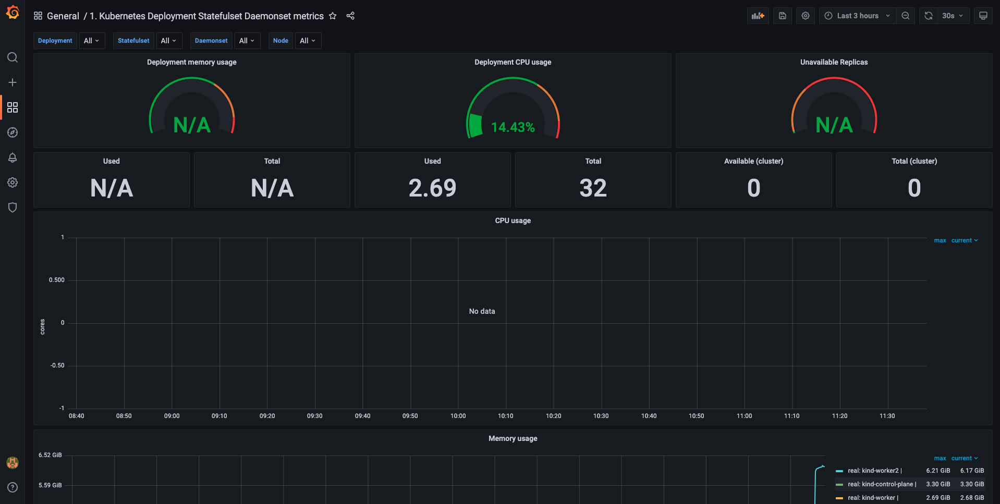

# a8s Demo

This repo is **WIP**.
The goal is to provide instructions to demo the new a8s product in the future.

# IMPORTANT

Please read the following information so we do not mess up the a9s PaaS system.

- When working with a9s Kubernetes on a9s PaaS, we need to ensure no `volumes`
are left behind. Therefore, ensure `kubectl get pvc` and `kubectl get sc` are
empty.

# Demo Script

## Setup Private Registry

TODO: a9s Kubernetes can use a9s Harbor's private projects. But the current
demo does use a public project.

```shell
export CF_HARBOR_INSTANCE_NAME=a8s-images-dev
export CF_HARBOR_INSTANCE_SERVICE_KEY=demo

cf service-key ${CF_HARBOR_INSTANCE_NAME} ${CF_HARBOR_INSTANCE_SERVICE_KEY}
```

```shell
export DOCKER_SERVER="service-key-dashboard_url-entry" # without https
export DOCKER_USERNAME="service-key-username-"
export DOCKER_PASSWORD="service-key-password-entry"
export DOCKER_EMAIL=${DOCKER_USERNAME}@anynines.com

kubectl create secret docker-registry a8s-registry --docker-server=${DOCKER_SERVER} --docker-username=${DOCKER_USERNAME} --docker-password=${DOCKER_PASSWORD} --docker-email=${DOCKER_USERNAME}@anynines.com
```

## Install a8s Operators

```shell
kubectl apply --filename deployment/cluster-operators.yaml
kubectl get pods --watch --namespace postgresql-system # 2/2 should appear after some time
# TODO: we should provide commands how to wait till the system settles down
# after installation.
```

Next we want to install a8s Backup Manager to backup and restore later on in
the demo the a8s data service instance.

The a8s Backup Manager components require AWS credentials to manage
backup files on S3.

FIXME: store them in 1password somewhere? Discuss with sales engineer
how approach certain things.
For the time being, you need an AWS access key id and secret access key for
the bucket `a8s-postgresql` in the region `eu-central-1` with read-write
permissions.

Insert AWS access credentials into the following files:
- `./access-key-id`
- `./secret-access-key`

**WATCH OUT** to not commit those files.

```shell
kubectl create secret generic a8s-backup-cloud-credentials -n a8s-system \
      --from-file=./access-key-id \
        --from-file=./secret-access-key
```

Install a8s Backup Manager components:
```shell
kubectl apply --filename deployment/a8s-backup-manager.yaml
kubectl get pods --watch --namespace a8s-system # 2/2 should be ready after some time
# TODO: we should provide commands how to wait till the system settles down
# after installation
```

Next, we need to install the service binding controller. Run the following commands:

```shell
kubectl apply --filename deployment/a8s-service-binding-controller.yaml # deploy the service binding controller.
kubectl get pods --watch --namespace a8s-system --selector service-binding-controller # observe the deployment to see when it's done.
```

After the last command, wait until the output shows that 2/2 containers are up and running:

```shell
NAME                                                  READY   STATUS    RESTARTS   AGE
service-binding-controller-manager-594d7fbf68-vwwx5   2/2     Running   0          30s
```

Finally, we need to apply some RBAC files so the current binding user can work with
the new custom resources:

```shell
kubectl apply --filename rbac/a8s-instance-user-role.yaml

vim rbac/a8s-instance-user-binding.yaml # set your binding user from `cf service-key ${INSTANCE_NAME} demo`

kubectl apply --filename rbac/a8s-instance-user-binding.yaml

kubectl get PostgreSQL # should work  without throwing a permission error
# the above cmd is optional to see we have access on that particular Kubernetes
# provider to the custom resource PostgreSQL
```


## Instance Creation, Usage and Deletion

Let's spawn up a new a8s data service instance:

```shell
cat deployment/instance.yaml

kubectl apply --filename deployment/instance.yaml

kubectl get pods --watch
kubectl get PostgreSQL
# TODO: we should probably provide commands/exaplanation here what to expect
# after we spawn up a new instance
```

Next we want to deploy a PostgreSQL demo app (`a9s-postgresql-app`) that will
use the new PostgreSQL instance to store data.

```shell
cat deployment/demo-app-deployment.yaml
```

First, we need to create a service binding resource that will configure a user for the demo app in
the PostgreSQL database and store the credentials for that user in a Kubernetes API secret.

```shell
cat deployment/service-binding.yaml # show the service binding manifest and explain it
kubectl apply --filename deployment/service-binding.yaml # create the service binding manifest
kubectl get sb --output yaml --watch # check whether the service binding has been successfully created; "sb" is shorthand for "servicebinding"
```

The last command outputs the whole YAML for the service binding, which is very verbose. You should
just comment on the status fields of the service bindings, which should look like this:

```shell
... other fields ...

status:
  implemented: true
  instanceUID: 2f4cee2d-d098-4c37-9f75-2a279079728b
  secret:
    name: sb-sample-service-binding
    namespace: default

... other fields ...
```

If the service binding was successfully configured, you should see `status.implemented: true`.

We need also need to create a database demo on our own for the demo app:

```shell
kubectl exec demo-pg-cluster-0 --container postgres -- "psql" "-U" "postgres" "-c" "CREATE DATABASE demo;"
```

Finally, we can deploy the app:

```shell
kubectl apply --filename deployment/demo-app-deployment.yaml
kubectl apply --filename deployment/demo-app-service.yaml

kubectl get pods --selector app=demo-app --watch
```

Expose the app to the outside world:

```shell
vim deployment/demo-app-ingress.yaml
# change DASHBOARD_URL placeholder to the url part after `https://dashboard-apps`
# from `dashboard_url`'s property in `cf service-key ${INSTANCE_NAME} demo`.

kubectl apply --filename deployment/demo-app-ingress.yaml
```

```shell
open https://demo-apps-DASHBOARD_URL
```

Create a new blog post entry.

Next we'll create a backup of the current database:

```shell
cat deployment/backup.yaml

kubectl apply --filename deployment/backup.yaml
```

In order to test restore, we'll first create another blog entry and then
restore to the latest backup.

```shell
kubectl apply --filename deployment/recovery.yaml
```

Delete service instance:
```shell
kubectl delete --filename deployment/instance.yaml

kubectl get pods --watch
kubectl get PostgreSQL
# TODO: explanation what to expect here/what to wait for
```

## Logging

### Forward Logs via Syslog to a9s LogMe

In order to see logs for the Kubernetes instance on an a9s LogMe instance, we
need to install a `DaemonSet` that will collect those logs from the Kubernetes
nodes and forward them to an a9s LogMe instance.

A `DaemonSet` ensures that all (or some) Nodes run a copy of a Pod. The pod in
our case will run `fluentd`. The `fluentd` tool will read the a9s Kubernetes
logs from the disk and forward them via syslog protocol to an a9s LogMe instance.

We first need to create an a9s LogMe instance:

```shell
cf create-service a9s-logme logme-single-small logme-demo-instance
```

Once the instance is available, we create a service key in order to get the
relevant information where the syslog endpoint is:

```shell
cf create-service-key logme-demo-instance binding1
cf service-key logme-demo-instance binding1

{
 "host": "syslog://lod855258-logstash.service.dc1.a9ssvc:514",
 "password": "a9s3e5644d6fd30994fa58c9a2a9daec65103bfcf45",
 "username": "a9s82018bc6554ffcf3df0d91dd1415ef88334d1ab0"
}
```

In the example output above, the syslog destination host would be
`lod855258-logstash.service.dc1.a9ssvc` and the syslog port `514`.

Next we can open the Kibana dashboard.
We can use the `cf service logme-demo-instance` command to display the
dashboard URL. Open the dashboard URL in a browser and authenticate.

You will be presented first with the a9s Service Dashboard. There is a link to
the Kibana dashboard at the top. Follow that link.

The Kibana dashboard will first present a page to `Configure an index pattern`.
Since we haven't received any logs so far, we cannot proceed yet.

We first need to install the logging components on the a9s Kubernetes instance
to stream the log message from the nodes to our a9s LogMe instance.

Before applying the relevant `yaml` files, we need to set the correct a9s Logme
destination host in the file `deployment/a8s-node-level-logging-syslog.yaml`.
The environment variable named `SYSLOG_HOST` needs to be set to the a9s LogMe
host name from the service binding above.

So in the example output from above, we would use the host name
`lod855258-logstash.service.dc1.a9ssvc`
and set the `SYSLOG_HOST` variable to that value.

Afterwards we can apply the logging components:

```shell
kubectl apply -f deployment/a8s-node-level-logging-permissions.yaml
kubectl apply -f deployment/a8s-node-level-logging-syslog.yaml
```

The creation of the logging component can be monitored via:

```shell
kubectl get daemonset -n kube-system -w
```

The `a8s-system` namespace should now list pods prefixed with the name
`fluentd`.

```shell
kubectl get pods -n a8s-system
```

```
NAME                                                  READY   STATUS    RESTARTS   AGE
a8s-backup-controller-manager-6d6946896d-9gb8g        2/2     Running   0          7d21h
fluentd-tdqql                                         1/1     Running   0          54s
fluentd-vbjp7                                         1/1     Running   0          55s
service-binding-controller-manager-594d7fbf68-s6jr4   2/2     Running   1          7d21h
```

Now we can get back to the Kibana dashboard. In the mean time the a9s LogMe
component should have received syslog messages.

The Kibana dashboard should now display `@timestamp` for the field
`Time Filter field name`. We need to click on the button `Create`.

Next we need to click on the page `Discover` from the left menu. We should see
the incoming syslog messages from our a9s Kubernetes system.

We can use the search field and enter `demo` to see the PostgreSQL cluster
messages.


We're done with the logging presentation.

Let's get rid of the a9s LogMe instance and the installed logging components on
the a9s Kubernetes instance.

```shell
cf delete-service-key logme-demo-instance binding1
cf delete-service logme-demo-instance
```

```shell
kubectl delete -f deployment/a8s-node-level-logging-syslog.yaml
kubectl delete -f deployment/a8s-node-level-logging-permissions.yaml
```

### Deploy EFK (Elasticsearch, Fluentd and Kibana) stack

#### Install Elasticsearch

Elasticsearch is the distributed, RESTful search and analytics engine which we
use to store, search and manage our cluster's logs. The Elasticsearch pods
are deployed as a part of a [StatefulSet][statefulset] since they require
persistent storage for the logs. This also allows us to span the pods over
multiple availability zones for high availability in order to limit possible
downtime.

```bash
kubectl apply -f deployment/a8s-namespace.yaml
kubectl apply -f deployment/elasticsearch.yaml
kubectl rollout status statefulset/es-cluster --namespace a8s-system
```

[statefulSet]: https://kubernetes.io/docs/concepts/workloads/controllers/statefulset/

#### Install Kibana

Kibana is a window into Elasticsearch. It provides a browser-based analytics
and search dashboard. We deploy it as a Kubernetes [Deployment][deployment]
since we don't require storage for Kibana.

```bash
kubectl apply -f deployment/kibana.yaml
kubectl rollout status deployment/kibana --namespace a8s-system
```

[deployment]: https://kubernetes.io/docs/concepts/workloads/controllers/deployment/

#### Install Fluentd DaemonSet

In order to see logs for the Kubernetes instance via Elasticsearch and Kibana,
we need to install a `DaemonSet` that will collect those logs from the
Kubernetes nodes and forward them to a Elasticsearch instance in our cluster.

A `DaemonSet` ensures that all (or some) Nodes run a copy of a Pod. The pod in
our case will run `fluentd`. The `fluentd` tool will read the a9s Kubernetes
logs from the disk and forward them via logstash format to the Elasticsearch
instance.

```shell
kubectl apply -f deployment/a8s-node-level-logging-permissions.yaml
kubectl apply -f deployment/a8s-node-level-logging-elasticsearch.yaml
```

#### Using Dashboard

First, get the Kibana pod name

```shell
kibana=$(kubectl get pod -l app=kibana --namespace a8s-system | grep kibana | awk -F ' ' '{print $1}')
```

Use port-forward to connect to the Kibana pod.

```shell
kubectl port-forward $kibana 5601:5601 --namespace=a8s-system
```

Open the Kibana dashboard in Browser link in browser.

```shell
open http://localhost:5601
```


Go to discover in the top left hand corner.


Create an index pattern for `logstash-*`. And click `> Next step`


Select `@timestamp` as a time filter field name. And then click
`Create index pattern`.


Go back to the discover tab.


The logs will be available to interact using your new filter.


## Metrics

Kubernetes provides out-of-the-box already control plane and container metrics
in prometheus format. These metrics can be scraped at the /metrics endpoint at
the Kubernetes API Server.

In order to scrape these logs we will deploy a Prometheus instance that is used
to scrape the system metrics and store them in the internal database.
Furthermore, we are going to deploy a Grafana dashboard which is able to query
the Prometheus database and visualize the metrics in a metrics dashboard.

### Prometheus

In the following, we will deploy and use Prometheus to scrape and store the
metrics on minikube.

#### Creation

First we need to install the Prometheus deployment.
We need to give Prometheus certain permissions to access the /metrics endpoint.
These permissions are defined in the `prometheus-permissions.yaml` file.
Moreover, we configure the Prometheus instance with the
`prometheus-configmap.yaml` file that defines the endpoints that will be
scraped as well as the corresponding scrape interval. The prometheus service
that is defined in the `prometheus-service.yaml` is used by the Grafana
dashboard.

```shell
kubectl apply -f deployment/prometheus-permissions.yaml
kubectl apply -f deployment/prometheus-configmap.yaml
kubectl apply -f deployment/prometheus-deployment.yaml
kubectl apply -f deployment/prometheus-service.yaml
```

The `a8s-system` namespace should now list pods prefixed with the name
`Prometheus`.

```shell
kubectl get pods -n a8s-system
```

```
NAME                                                  READY   STATUS    RESTARTS   AGE
a8s-backup-controller-manager-6d6946896d-9gb8g        2/2     Running   0          7d21h
prometheus-deployment-87cc8fb88-fvg48                 1/1     Running   0          54s
service-binding-controller-manager-594d7fbf68-s6jr4   2/2     Running   1          7d21h
```

### Grafana

In the following, we are going to deploy a Grafana dashboard that will query the
system metrics that are scraped by Prometheus and display them in a metrics
dashboard.

### Creation

Just as for the Prometheus instance, we will deploy the Grafana dashboard in the
`a8s-system` namespace. In case it doesn't exist yet it can be created using
the following command:

```shell
kubectl apply -f dashboard/a8s-system.yaml
```

First we need to deploy the Grafana dashboard.

```shell
kubectl apply -f deployment/grafana-configmap.yaml
kubectl apply -f deployment/grafana-deployment.yaml
kubectl apply -f deployment/grafana-service.yaml
```

It is configured in a way to periodically send queries to the Prometheus
service. By default Grafana does not come with any default dashboard. If we
want to use one we either need to define it ourselves or we can import an
existing one from the [Grafana Dashboards][https://grafana.com/grafana/dashboards]
page using the Dashboard ID. In order to access the Grafana dashboard we need a
port-forward:

```shell
kubectl port-forward -n a8s-system service/grafana 3000 &
```

Now the Grafana dashboard can be accessed using:

```shell
open http://localhost:3000
```

The default login credentials are `admin` for both username and password.

#### Using Dashboard

After Grafana has been deployed we need to import a dashboard in order to
visualize the Kubernetes system metrics that are scraped by the Prometheus
instance.


Go to the Dashboards section in the left menu.


Then go to the Manage page.


Click on Import on the right hand side.


 
Then Insert `8588` as the Dashboard ID and click on Load.


Choose Prometheus as the data source.



Now the imported metrics dashboard should visualize some of the metrics
that are scraped by the Prometheus instance. In case we want to show metrics
of the Kubernetes API server we can use the pre-build metrics dashboard with
the ID `12006`.

# Requirements

In order to demonstrate the a9s Data Services product, we need the following
things:
- Kubernetes to demonstrate the product on
- this repo that contains some yaml manifests

The images for the demo are currently stored on a temporary a9s Harbor service
instance on a9s PaaS. This will be changed in the future to provide a more
reliable solution.

## Kubernetes

## Setup a9s Kubernetes

Login to a9s PaaS to the appropriate CF org+space.

Create an a9s Kubernetes instance:

```shell
export INSTANCE_ID=1
export INSTANCE_PREFIX=a8s-demo

export INSTANCE_NAME=${INSTANCE_PREFIX}-${INSTANCE_ID}

export PLAN_NAME=kubernetes-1-master-1-worker-small

cf cs a9s-kubernetes ${PLAN_NAME} ${INSTANCE_NAME}

cf csk ${INSTANCE_NAME} demo
cf service-key ${INSTANCE_NAME} demo
```

Create kubectl config to access the new a8s Kubernetes instance:

```shell
export KUBECONFIG=kube.config.${INSTANCE_NAME}

echo "paste here the copied kubeconfig" > ${KUBECONFIG}

kubectl get pods # should work
```

Setup storage for persistent volumes:
```shell
kubectl apply --filename deployment/a9s-kubernetes-storageclass.yaml
kubectl describe StorageClasses
```

## Images

This step will be obsolete once the a8s team has a production ready private
registry.

Currently, there is an a9s Harbor instance on a9s PaaS.

The CF service key `demo` has read-only access to the project `demo`
on a9s PaaS.

```
# org anynines / space dsteam as concourse...
cf service a8s-images-dev
cf service-key a8s-images-dev demo
```

### Push Images Step (Optional)

This step shows how to use a9s Harbor to host (dev) images in the Harbor
registry.

```shell
export VERSION=0.2.0
export PROJECT=demo
export REGISTRY=c4aeb71c-dd2a-4e6e-9385-1c3bb839307c.de.a9s.eu # a9s Harbor dashboard_url

docker login ${REGISTRY} # with a CF service key that has write access to the project

docker tag controller ${REGISTRY}/${PROJECT}/postgresql-controller:${VERSION}
docker tag backup-agent ${REGISTRY}/${PROJECT}/backup-agent:${VERSION}

docker push ${REGISTRY}/${PROJECT}/postgresql-controller:${VERSION}
docker push ${REGISTRY}/${PROJECT}/backup-agent:${VERSION}
```

# TODOs

- [x] demo app (a9s-postgresql-app)
- [ ] get sales engineer involved
- [ ] use a9s Harbor private registry
- [ ] hosted registry solution so the location of the image stays the same ->
  a9s Harbor as per a8s meeting 2021-02-24
- [ ] automate some many manual steps, maybe via `kustomize` run!?
- [x] a8s Backup Manager integration
- [x] service bindings
- [ ] What is the future product name?
- [ ] master switchover
- [ ] setup a demo user on a9s PaaS? -> sales engineer
- [ ] step that describes 1password credentials for org/space on a9s PaaS
